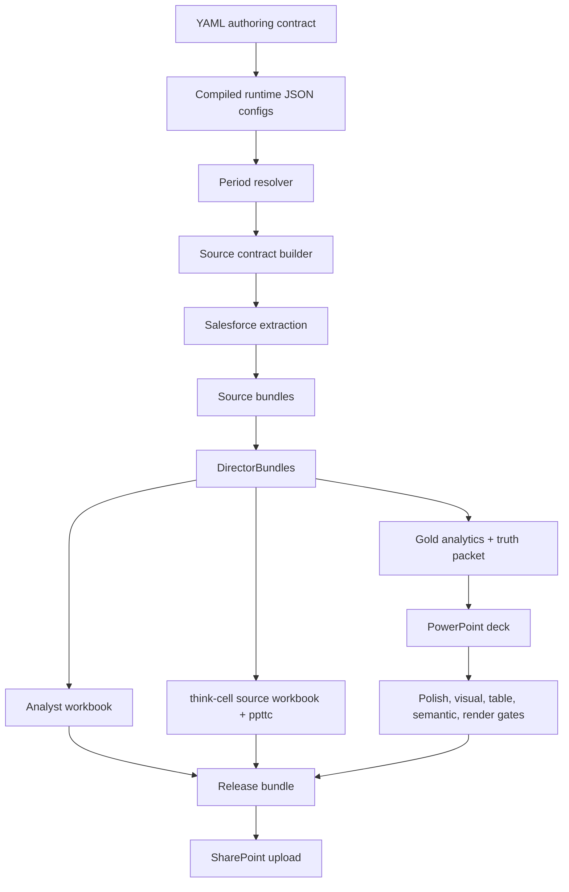

# GPT-5.5 Pro Architecture Review Brief — Sales Director Monthly Source-Backed Platform

Date: 2026-04-24
Repo: `/Users/test/crm-analytics`
Current live baseline: `2026-04-30` / `live-all-sources-pipeline-open-v17`
Purpose: external architecture review against the target goal, not just code review.

## Paste-Ready Prompt

You are reviewing a local-first Salesforce-to-Excel-to-PowerPoint automation platform for Sales Director monthly reviews. The goal is to determine whether the architecture is right for the business goal, identify over/under-engineering, and recommend upgrades.

Business goal:

- Every month, extract Salesforce data from specified reports/list views by region/director.
- Roll dates automatically: month-end snapshot, current quarter, prior quarter, forward quarter.
- Be month-aware and quarter-aware.
- If a region lacks current-quarter pipeline, pull next-quarter pipeline as fallback.
- Analyze systematically in Excel using deterministic, audit-friendly logic.
- Output polished, human-looking analyst workbooks and PowerPoint decks in a standard table format.
- Support think-cell or a similar Excel-linked PPT lane without visual/table drift.
- Publish to SharePoint with strong gates.
- Make adding/removing reporting requirements or Salesforce data sources config-only where possible.
- Avoid Power BI as the primary output; the deliverable is Excel + PowerPoint.
- Local-first is preferred. Microsoft Graph/SharePoint integration is fine. Full cloud/Fabric replatforming should only be recommended if clearly superior.

Please review the architecture below and answer:

1. Is the current architecture directionally right for the goal?
2. What are the biggest architectural risks or false-comfort areas?
3. What should be simplified, split, or replaced?
4. Is the YAML-authoring → JSON-runtime contract the right approach, or should the config model be different?
5. Should orchestration stay as procedural Python, move to a lightweight DAG engine, or use another local workflow pattern?
6. How should source contracts, Salesforce report/list-view IDs, schema checks, freshness checks, and row-count policies evolve?
7. How should the Excel analyst workbook and think-cell workbook be separated or unified?
8. How should the PowerPoint generation and table-format contract be hardened?
9. What should be done in the next 1-2 days, next week, and next month?
10. What would you change if this needed to run reliably every month without Andre babysitting it?

Be direct. Do not merely praise the current system. Call out structural problems, unnecessary complexity, missing abstractions, brittle assumptions, observability gaps, and ways to make this consultant-grade.

## Executive Summary

This repo contains a Salesforce CRM Analytics / Sales Director reporting automation system. The active lane is a local Python pipeline that extracts Salesforce report/list-view data, normalizes it into source bundles and DirectorBundles, builds an analyst workbook, builds a think-cell source workbook and `.ppttc` payload, generates a PowerPoint deck, validates the deck against truth/table/semantic/render gates, packages artifacts, and uploads to SharePoint.

The current system is not a clean greenfield product. It grew through many deck/dashboard iterations and contains substantial legacy scripts. The current best architecture seam is the newer source-backed monthly platform under `scripts/monthly_platform/` plus the source-backed runner `scripts/run_source_backed_monthly_pipeline.py`.

The latest live proof is green:

- Run: `live-all-sources-pipeline-open-v17`
- Snapshot: `2026-04-30`
- Stages: `23/23` ok
- Release checks: `20/20` pass
- YAML authoring sync: `3` targets, `0` drift
- Salesforce sources: `55` selected / `55` executed / `55` extracted
- Source bundles: `9`
- DirectorBundles: `9`
- Quarter policy: `calendar_quarter`
- Current quarter: `Q2 2026`
- Forward quarter: `Q3 2026`
- Current-quarter empty territories: `5`
- Forward fallback territories: `4`
- Truth packet: `0` high blockers, `0` tie-out mismatches
- Deck: `6` slides
- Table contract: `5` standard tables, `0` findings
- Semantic score: `100`
- SharePoint: `5` uploaded, `0` skipped

Important caveat: the corporate fiscal year starts February 1, but the current live source registry is explicitly locked to calendar quarter labels because the Salesforce reports/list views and deck naming currently use Q2/Q3 calendar-style labels for the April 30 run. Fiscal-quarter support exists in code but production is not flipped to it. This needs architectural review.

## Non-Negotiable Constraints

- Target Salesforce org: `apro@simcorp.com` / `simcorp.my.salesforce.com`.
- Preferred extraction path: `sf` CLI + Salesforce REST/report/list-view APIs.
- Avoid hidden SOQL as primary source; SOQL should only validate/tie out where possible.
- Do not mutate production dashboards in this lane.
- Power BI is not desired as the primary consumption surface.
- Final outputs are Excel, PowerPoint, think-cell-compatible source payloads, and SharePoint release artifacts.
- The deck must not look AI-generated. It needs deterministic, human-style analysis and standard PowerPoint table formatting.
- Adding/removing reporting requirements should be config-first and ideally not require edits to runner code.

## Current Architecture

### 1. Human Authoring Layer

File:

- `config/source_contracts/sales_director_monthly.yaml`

This is the new human-editable source contract. It contains a `compiled_targets` block that currently compiles/checks three runtime JSON configs:

- `config/monthly_source_requirements.json`
- `config/sd_monthly_territories.json`
- `config/monthly_director_bundle_contract.json`

Compiler/checker:

- `scripts/compile_monthly_source_contract_config.py`

Design intent:

- YAML is for humans.
- JSON remains the deterministic runtime format for scripts, hashing, and tests.
- The runner blocks before Salesforce extraction if YAML and JSON drift.

Current issue:

- The YAML file is useful but still not ergonomic enough. It is currently a large wrapper around JSON payloads. The next evolution should likely split it into smaller authored YAML files with anchors/common field packs, then compile to JSON.

### 2. Runtime Configs

#### Source Requirements

File:

- `config/monthly_source_requirements.json`

Current requirements:

| Requirement | Type | Dataset | Scope | Period roles | Required fields |
|---|---|---|---|---|---:|
| `sd_pipeline_open` | Salesforce list view | `pipeline_open` | territory | current quarter | 11 |
| `sd_pipeline_open_reference` | Salesforce report | `pipeline_open_reference` | global | current quarter | 4 |
| `sd_historical_trending` | Salesforce report | `historical_trending` | territory | prior/current/forward | 5 |
| `sd_pipeline_inspection` | Salesforce list view | `pipeline_inspection` | territory | current/forward | 5 |

This registry says what data the monthly platform needs and how to resolve source IDs.

#### Territory Registry

File:

- `config/sd_monthly_territories.json`

Current territories: `9`

- APAC — Jesper Tyrer
- Central Europe — Sarah Pittroff
- UK & Ireland — Dan Peppett
- Southern Europe — Francois Thaury
- NL & Nordics — Christian Ebbesen
- Middle East & Africa — Mourad Essofi
- Canada — Megan Miceli
- NA Asset Management — Patrick Gaughan
- Pension & Insurance — Adam Steinhaus

Each territory has:

- Director name
- SOQL where clause, mostly legacy/validation support
- Pipeline open list view ID/label
- Current PI list view ID/label
- Forward-quarter PI list view IDs
- Historical trending report IDs for Q1/Q2
- Forward-quarter historical trending report IDs for Q3

This is the operational source-ID registry.

#### DirectorBundle Contract

File:

- `config/monthly_director_bundle_contract.json`

Dataset policies:

- Source-backed and publish-required:
  - `pipeline_open`
  - `pi_current`
  - `pi_forward`
  - `snapshot_trend`
- Optional-empty today:
  - `won_lost`
  - `renewals`
  - `approvals`
  - `activity`
  - `commit_items`
  - `stage_events`
  - `forecast_category_events`
  - `close_date_events`
  - `movement_prior`
  - `movement_current`

This is important because it prevents the deck from silently claiming unsupported datasets as real.

### 3. Period Resolver

File:

- `scripts/monthly_platform/period.py`

Responsibilities:

- Resolve month-end snapshot.
- Resolve current quarter, prior quarter, forward quarter.
- Resolve reporting window.
- Emit explicit quarter policy metadata.

Current production behavior:

- `quarter_policy_name="calendar_quarter"` by default.
- Fiscal mode exists as explicit `quarter_policy_name="fiscal_quarter"` with configurable fiscal start month.

Architectural tension:

- Repo/global org instructions say fiscal year starts February 1.
- Current Salesforce report IDs/list-view labels are wired to calendar-style Q2/Q3 behavior for the April 30 snapshot.
- The team intentionally locked this to `calendar_quarter` to avoid silent drift.
- GPT should assess whether production should migrate to fiscal, whether labels should be renamed, and how to avoid report-ID mismatches during migration.

### 4. Source Contract Builder

File:

- `scripts/build_monthly_source_contract.py`

Responsibilities:

- Given a snapshot date and territory config, produce a manifest of expected Salesforce reports/list views.
- Include period and quarter policy.
- Check missing report IDs.
- Check bundle presence when run after extraction.
- Decide current-quarter empty and forward-quarter fallback requirements.

Live v17 source contract:

- Status: `ok`
- Territories: `9`
- Current-quarter empty territories: `5`
- Forward fallback territories: `4`
- Quarter policy: `calendar_quarter`
- Current quarter: `Q2 2026`
- Forward quarter: `Q3 2026`

### 5. Salesforce Extraction

File:

- `scripts/extract_salesforce_sources.py`

Related modules:

- `scripts/monthly_platform/source_requirements.py`
- `scripts/monthly_platform/salesforce_auth.py`
- `scripts/monthly_platform/salesforce_reports.py`
- `scripts/monthly_platform/storage.py`

Responsibilities:

- Build a source requirement plan from requirements + territories + period.
- Resolve report/list-view IDs.
- Execute Salesforce extractions.
- Normalize rows.
- Store raw/normalized outputs with schema/rowset metadata.

Live v17:

- `55` selected sources
- `55` executed
- `55` extracted
- `0` failed

### 6. Source Bundles and DirectorBundles

Files:

- `scripts/build_source_bundles_from_extracts.py`
- `scripts/build_director_bundles_from_sources.py`
- `scripts/monthly_platform/source_bundles.py`
- `scripts/monthly_platform/director_bundle_builder.py`
- `scripts/monthly_platform/bundle_validation.py`

Concept:

- SourceBundle = territory-level normalized source data from Salesforce extracts.
- DirectorBundle = publish-facing data package for one director/territory, conforming to the DirectorBundle contract.

Live v17:

- Source bundles: `9`
- DirectorBundles: `9`
- Missing selected sources: `0`

### 7. Excel Analyst Workbook

File:

- `scripts/build_source_backed_analyst_workbook.py`

Related module:

- `scripts/monthly_platform/analyst_workbook.py`

Purpose:

- Build the human-facing analyst workbook.
- Include source extracts, metric store, deal exceptions, region narrative inputs, and deterministic analysis tabs.

Design intent:

- This workbook is for analysis and auditability.
- It can be richer and more verbose than the think-cell workbook.
- It should feel like a human analyst built it, not an AI dump.

Potential issue:

- Need review whether the workbook is currently a polished analyst artifact or still too pipeline/artifact-like.
- Need decide whether formulas/pivots/tables should be more native Excel, and how much calculation should live in Python vs Excel.

### 8. think-cell Lane

File:

- `scripts/build_thinkcell_source_from_bundles.py`

Related module:

- `scripts/monthly_platform/thinkcell_source.py`

Outputs:

- `thinkcell_source.xlsx`
- `thinkcell_data.ppttc`

Purpose:

- Provide a clean, minimal, chart/table-linked workbook/payload for standard PowerPoint elements.

Design principle:

- The analyst workbook and think-cell source workbook are intentionally separate:
  - Analyst workbook: human-readable investigation, evidence, calculations.
  - think-cell workbook: strict machine-facing slide data surface.

Architecture question:

- Is this separation right?
- Should there be a single canonical metric store feeding both, with the analyst workbook and think-cell workbook as projections?
- Should the `.ppttc` generation be replaced, hardened, or integrated more directly with the deck builder?

### 9. Truth Packet and Gold Analytics

Files:

- `scripts/build_director_gold_analytics.py`
- `scripts/build_deck_truth_packet.py`

Purpose:

- Produce canonical facts/claims.
- Tie deck claims back to source-derived metrics.
- Prevent hallucinated or stale deck text.

Live v17:

- Directors: `9`
- Metrics: `60`
- Claims: `60`
- High blockers: `0`
- Tie-out mismatches: `0`

### 10. PowerPoint Deck Generation

Files:

- `scripts/build_source_backed_deck.py`
- `scripts/polish_source_backed_deck_language.py`

Validation files:

- `scripts/validate_source_backed_deck_visuals.py`
- `scripts/validate_source_backed_deck_table_contract.py`
- `scripts/validate_source_backed_deck_semantics.py`
- `scripts/validate_source_backed_deck_render.py`

Purpose:

- Generate a standardized Sales Director monthly review deck.
- Maintain previously-developed table format.
- Apply deterministic language polish.
- Validate visuals, tables, semantics, and headless render.

Live v17:

- Deck slides: `6`
- Tables: `5`
- Visual findings: `0`
- Table contract findings: `0`
- Semantic findings: `0`
- Human-style score: `100`
- Render findings: `0`

Potential issue:

- A high score from deterministic validators is not proof the deck is genuinely executive-grade. It proves the current checks pass. GPT should evaluate whether visual regression, table contract, semantic checks, and human review gates are sufficient.

### 11. Release Bundle and SharePoint

Files:

- `scripts/build_source_backed_release_bundle.py`
- `scripts/upload_sales_deck_release_to_sharepoint.py`

Live v17:

- Required artifacts copied: `21`
- Missing artifacts: `0`
- Release zip size: `451641` bytes
- SharePoint planned assets: `5`
- SharePoint uploaded: `5`
- SharePoint skipped: `0`

Published assets:

- Release bundle zip
- Review deck `.pptx`
- Analyst workbook `.xlsx`
- think-cell source workbook `.xlsx`
- think-cell `.ppttc` payload

## Current Runner

File:

- `scripts/run_source_backed_monthly_pipeline.py`

Default period-aware launcher:

- `scripts/run_source_backed_monthly_default.py`

The runner is procedural Python, not a DAG engine.

Live v17 stage order:

1. `source_contract_authoring_config_check`
2. `pi_list_view_filter_audit`
3. `source_contract_preflight`
4. `source_contract_requirement_lint`
5. `extract_salesforce_sources`
6. `build_source_bundles`
7. `build_director_bundles`
8. `source_contract_final`
9. `dataset_readiness_pipeline_open`
10. `build_analyst_workbook`
11. `build_thinkcell_source`
12. `source_backed_publish_gate`
13. `build_director_gold_analytics`
14. `build_deck_truth_packet`
15. `build_source_backed_deck`
16. `polish_source_backed_deck_language`
17. `validate_source_backed_deck_visuals`
18. `validate_source_backed_deck_table_contract`
19. `validate_source_backed_deck_semantics`
20. `validate_source_backed_deck_render`
21. `build_source_backed_release_bundle`
22. `plan_source_backed_sharepoint_upload`
23. `upload_source_backed_sharepoint_assets`

Release packet blocks publish unless all 20 release checks pass:

- Runner status ok
- Required stages ok
- YAML authoring synced
- Source contract preflight clean
- Source requirement lint clean
- Final source contract clean
- Quarter policy locked
- PI list-view audit clean
- Salesforce extracts complete
- Source bundles complete
- DirectorBundles complete
- Publish gate clean
- Truth packet clean
- Deck visuals clean
- Deck polish clean
- Deck table contract clean
- Deck semantics clean
- Deck render clean
- Release bundle complete
- SharePoint upload plan clean

## Artifact Layout

Key live v17 artifacts:

- Runner manifest: `output/source_backed_monthly_pipeline_runs/2026-04-30/live-all-sources-pipeline-open-v17/pipeline_run_manifest.json`
- Release packet: `output/monthly_review_release_packets/2026-04-30/live-all-sources-pipeline-open-v17/source_backed_release_packet.json`
- YAML authoring check: `output/monthly_source_contract_authoring/2026-04-30/live-all-sources-pipeline-open-v17/source_contract_authoring_check.json`
- Source contract: `output/monthly_source_contract/live-all-sources-pipeline-open-v17/2026-04-30/monthly_source_contract.json`
- Raw/normalized source manifest: `output/monthly_salesforce_sources/2026-04-30/live-all-sources-pipeline-open-v17/run_manifest.json`
- Source bundle manifest: `output/monthly_source_bundles/2026-04-30/live-all-sources-pipeline-open-v17/source_bundle_manifest.json`
- DirectorBundle manifest: `output/monthly_director_bundles_from_sources/2026-04-30/live-all-sources-pipeline-open-v17/director_bundle_manifest.json`
- Analyst workbook: `output/monthly_director_bundles_from_sources/2026-04-30/live-all-sources-pipeline-open-v17/source_backed_analyst_workbook.xlsx`
- think-cell source: `output/thinkcell_source_from_bundles/2026-04-30/live-all-sources-pipeline-open-v17/thinkcell_source.xlsx`
- think-cell payload: `output/thinkcell_source_from_bundles/2026-04-30/live-all-sources-pipeline-open-v17/thinkcell_data.ppttc`
- Truth packet: `output/deck_truth_packets_from_sources/live-all-sources-pipeline-open-v17/2026-04-30/deck_truth_packet.json`
- PowerPoint deck: `output/source_backed_decks/2026-04-30/live-all-sources-pipeline-open-v17/source_backed_monthly_review.pptx`
- Table audit: `output/source_backed_deck_table_contract/2026-04-30/live-all-sources-pipeline-open-v17/source_backed_deck_table_contract_audit.json`
- Render audit: `output/source_backed_deck_renders/2026-04-30/live-all-sources-pipeline-open-v17/source_backed_deck_render_audit.json`
- Release bundle: `output/source_backed_release_bundles/2026-04-30/live-all-sources-pipeline-open-v17/source_backed_release_bundle.zip`
- SharePoint result: `output/source_backed_sharepoint_uploads/2026-04-30/live-all-sources-pipeline-open-v17/sharepoint_upload_result.json`
- Latest aliases: `output/source_backed_monthly_pipeline_runs/latest.json`, `output/source_backed_monthly_pipeline_runs/latest.md`

## What Has Improved Recently

1. The pipeline is now source-backed rather than workbook/shell-first.
2. PI list view filter audit prevents broken regional scoping from reaching directors.
3. Quarter policy is explicit and locked.
4. YAML authoring sync was added before Salesforce extraction.
5. Release packet now fails closed if source contract, YAML sync, visuals, tables, semantic readiness, render, bundle, or SharePoint handoff are not clean.
6. SharePoint upload is integrated as a gated stage.
7. Deck table contract validates the previously developed table format.
8. Latest aliases point to the current green baseline.

## Known Concerns / Review Targets

### 1. Config Ergonomics

The YAML layer is directionally right, but the first implementation wraps three JSON configs inside one large YAML file. This may not be the best long-term authoring model.

Potential better target:

- `config/source_contracts/sales_director_monthly.yaml` as index/metadata
- `config/source_contracts/requirements/*.yaml`
- `config/source_contracts/territories/*.yaml`
- `config/source_contracts/field_packs/*.yaml`
- `config/source_contracts/bundle_contract.yaml`
- YAML anchors for common fields and policies
- Compiler emits deterministic runtime JSON

GPT should assess whether this is worth doing now.

### 2. Quarter Policy Ambiguity

Current production is calendar-quarter locked, but the business/org fiscal year starts February 1. This could become a serious reporting label/source-ID mismatch.

Questions:

- Should the platform use fiscal quarters everywhere?
- Should Salesforce report/list-view IDs be migrated to fiscal labels?
- Should the runner support both `business_quarter_label` and `source_registry_quarter_label`?
- How should fallback rules behave under fiscal vs calendar?

### 3. Procedural Runner vs Workflow Engine

Current runner is a single Python script with stage definitions. It is transparent and easy to run locally, but may become unwieldy.

Questions:

- Keep procedural runner?
- Move to a tiny internal DAG abstraction?
- Use Prefect/Dagster/Airflow? Probably too heavy, but GPT should evaluate.
- Need resume/retry per stage?
- Need parallel extraction per source/territory?
- Need artifact caching and invalidation?

### 4. Artifact Sprawl

The output tree is rich but sprawling. Good for auditability, bad for operator simplicity.

Questions:

- Should there be a run manifest database or local artifact catalog?
- Should `latest.json` be the only operator entrypoint?
- Should SharePoint receive an index HTML/Markdown summary?
- Should old runs be archived/compressed automatically?

### 5. Validation Quality

The system has many gates, but deterministic gates can create false confidence.

Questions:

- What additional gates are needed for executive-grade deck quality?
- Should there be visual regression against a golden deck?
- Should there be a human review checklist embedded in release packet?
- Should LLM critique be used only after deterministic truth gates pass?

### 6. Excel vs Python Calculation Boundary

Current architecture likely computes most metrics in Python and renders Excel as an artifact.

Questions:

- Should Excel contain more formulas/tables/pivots for analyst transparency?
- Should Python remain the canonical calculation engine?
- Should a DuckDB metric store sit between bundles and workbook/deck?
- How should analysts inspect exceptions and source rows?

### 7. think-cell Integration

Current lane emits `thinkcell_source.xlsx` and `.ppttc`.

Questions:

- Is `.ppttc` enough?
- Should the PowerPoint deck be fully generated without think-cell?
- Should think-cell be used only for manual refresh from standardized Excel ranges?
- How to guarantee named ranges and PPT elements never drift?

### 8. Salesforce Source Governance

Report/list-view IDs are explicit in config. This is good for determinism but brittle if Salesforce users edit/delete reports or filters.

Questions:

- Should source contracts include owner, freshness SLA, report modified date, expected schema hash, and min/max row bounds?
- Should the platform auto-detect report/list-view filter drift before extraction?
- Should IDs be refreshed automatically from report/list-view developer names?
- Should there be a "source registry promotion" workflow for Q4/future quarters?

### 9. Local-First Orchestration and Multi-Agent Work

The desired operating model includes Codex/Claude style agents working in parallel, but the current runner is still a local CLI pipeline.

Questions:

- Should agents only modify code/config, while the runner remains deterministic?
- Should agents produce review packets but not touch source data?
- Should there be a task queue/ledger for long-running work?
- How to avoid duplicate agent edits and stale handoffs?

### 10. SharePoint / Microsoft Graph

SharePoint upload works. No Power BI desired.

Questions:

- Should SharePoint be the release portal with run summaries, artifacts, and approvals?
- Should Graph be used for permissions, versioning, folder discovery, and Teams notifications?
- Should Excel Online refresh or Office Scripts be used, or keep all workbook creation local?

## Recommended Review Deliverable Format

Please return:

1. Architecture verdict: keep, revise, or replace.
2. Top 10 risks ranked by severity.
3. Target architecture diagram.
4. Recommended config model, especially YAML vs JSON split.
5. Recommended orchestration model.
6. Recommended data model/artifact catalog.
7. Recommended Excel/think-cell/PowerPoint lane.
8. Recommended validation/publish gates.
9. 1-2 day action plan.
10. 1-week action plan.
11. 1-month architecture roadmap.
12. Specific files/modules to change first.

## Important Source Files to Review

Config:

- `config/source_contracts/sales_director_monthly.yaml`
- `config/monthly_source_requirements.json`
- `config/sd_monthly_territories.json`
- `config/monthly_director_bundle_contract.json`
- `config/salesforce_field_guardrails.json`

Orchestration:

- `scripts/run_source_backed_monthly_pipeline.py`
- `scripts/run_source_backed_monthly_default.py`

Config compiler:

- `scripts/compile_monthly_source_contract_config.py`

Period/source contracts:

- `scripts/monthly_platform/period.py`
- `scripts/monthly_platform/source_requirements.py`
- `scripts/build_monthly_source_contract.py`
- `scripts/lint_monthly_source_contract.py`

Extraction/storage:

- `scripts/extract_salesforce_sources.py`
- `scripts/monthly_platform/salesforce_auth.py`
- `scripts/monthly_platform/salesforce_reports.py`
- `scripts/monthly_platform/storage.py`

Bundles:

- `scripts/build_source_bundles_from_extracts.py`
- `scripts/build_director_bundles_from_sources.py`
- `scripts/monthly_platform/source_bundles.py`
- `scripts/monthly_platform/director_bundle_builder.py`
- `scripts/monthly_platform/bundle_validation.py`

Excel/think-cell:

- `scripts/build_source_backed_analyst_workbook.py`
- `scripts/monthly_platform/analyst_workbook.py`
- `scripts/build_thinkcell_source_from_bundles.py`
- `scripts/monthly_platform/thinkcell_source.py`

Deck/truth:

- `scripts/build_director_gold_analytics.py`
- `scripts/build_deck_truth_packet.py`
- `scripts/build_source_backed_deck.py`
- `scripts/polish_source_backed_deck_language.py`

Validation:

- `scripts/validate_monthly_source_backed_run.py`
- `scripts/validate_source_backed_deck_visuals.py`
- `scripts/validate_source_backed_deck_table_contract.py`
- `scripts/validate_source_backed_deck_semantics.py`
- `scripts/validate_source_backed_deck_render.py`

Publish:

- `scripts/build_source_backed_release_bundle.py`
- `scripts/upload_sales_deck_release_to_sharepoint.py`

Tests:

- `tests/test_compile_monthly_source_contract_config.py`
- `tests/test_run_source_backed_monthly_pipeline.py`
- `tests/test_build_monthly_source_contract.py`
- `tests/test_sales_director_monthly_period.py`
- `tests/test_source_requirements.py`
- `tests/test_monthly_storage.py`
- `tests/test_validate_source_backed_deck_table_contract.py`
- `tests/test_validate_source_backed_deck_visuals.py`
- `tests/test_validate_source_backed_deck_render.py`

Current handoff:

- `docs/2026-04-24-source-backed-monthly-runner-plan.md`

## Bottom-Line Assessment for Reviewer

The architecture is now materially better than a script pile: it has source contracts, explicit periods, authoring/runtime config separation, bundles, deterministic gates, release packets, and SharePoint publishing.

However, it may still be too procedural, too artifact-sprawly, and not yet ergonomic enough for future reporting changes. The highest-value review is not "does it work once?" — v17 proves it does. The review should ask whether this is the right operating model for repeatable monthly production, faster source onboarding, and polished executive deliverables without constant human rescue.
