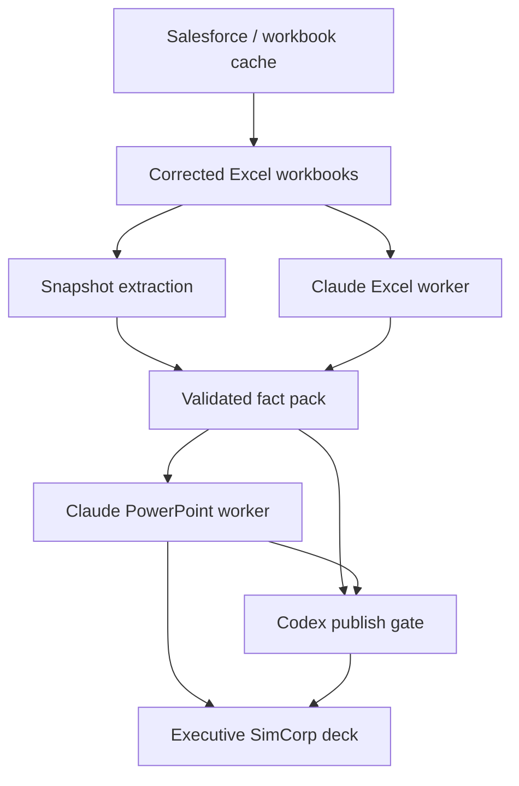

# Sales Director AI Workstation Architecture

Date: 2026-04-10

## Decision

Build the monthly Sales Director deck system as a hybrid AI workstation:

- `Codex Desktop` is the control plane
- `Claude for Excel` is the workbook-analysis worker
- `Claude for PowerPoint` is the deck-authoring and deck-audit worker
- corrected workbook snapshots and validated fact packs are the data contract

This is the target production architecture for the monthly cadence.

## Why This Architecture

The system needs four things at once:

1. native SimCorp PowerPoint fidelity
2. strict factual reporting from corrected Salesforce-derived workbooks
3. repeatable monthly execution with artifacts and publish gates
4. controlled use of AI where narrative and Office-native editing help, without allowing AI to become the source of truth for numbers

No single tool satisfies all four.

`Codex only` is strong on orchestration and validation but weaker on native Office authoring fidelity.

`Claude add-ins only` are strong on native Office authoring but weaker on factual determinism, auditability, and batch cadence control.

The hybrid design is the minimum architecture that satisfies the product need.

## Goals

- Produce one executive enterprise deck per MD-1 on a monthly cadence.
- Preserve the native SimCorp PowerPoint template, masters, layouts, and styling.
- Keep all metrics strict on `ARR (€ converted)` versus `ACV (€ converted)`.
- Force quarter and horizon labeling for all pipeline numbers.
- Validate Excel-Claude and PowerPoint-Claude outputs before decks are treated as publishable.
- Support batch orchestration across 9 directors without losing per-director artifacts.
- Retain a deterministic fallback lane when AI workers fail.

## Non-Goals

- Replacing Salesforce or the workbook build pipeline
- Letting AI directly define source-of-truth numbers
- Using Microsoft 365 connector as the primary execution surface
- Making UI automation the core system design
- Making Cowork the primary audited production path

## Constraints

- The existing workbook layer is already built and corrected at `output/director_data_dumps/<date>/`.
- The native SimCorp PowerPoint template is external to the repo and must remain the primary brand surface.
- Claude for Excel is beta and is not suitable for final deliverables without human review.
- Microsoft 365 connector is read-only.
- Third-party/gateway Office add-in paths currently trade away some higher-value features like skills and work-across-apps.

## Architecture Principles

1. `Facts before narrative`
   - All narratives must be downstream of validated fact packs.
2. `Native Office where it matters`
   - Final deck authoring and rewrite should happen in PowerPoint, not through a synthetic renderer alone.
3. `Deterministic control plane`
   - Every monthly run must emit manifests, artifacts, and gate decisions.
4. `AI workers are specialized`
   - Excel Claude analyzes. PowerPoint Claude rewrites and audits. Codex orchestrates and validates.
5. `No silent metric drift`
   - ARR, ACV, omitted-stage treatment, and horizon labeling are publish blockers.

## System Context

## Core Components

### 1. Source Layer

Source-of-truth inputs:

- corrected director workbooks in `output/director_data_dumps/<snapshot-date>/`
- hidden workbook caches used by snapshot extraction
- external policy/context references:
  - Sales Handbook
  - approval policy
  - Finance churn inputs when available

This layer is factual and non-AI.

### 2. Canonical Data Layer

Canonical machine-readable contract:

- `output/director_workbook_snapshots/<snapshot-date>/<director>.json`

Primary builder:

- [extract_director_workbook_snapshot.py](/Users/test/crm-analytics/scripts/extract_director_workbook_snapshot.py)

Why it exists:

- normalize workbook tabs
- rebuild director-safe Q1 logic from hidden cache where the workbook tab is contaminated
- expose stable fields for orchestration and validation

This is the first publishable truth layer inside the repo.

### 3. Excel Analysis Worker

Worker:

- installed `Claude for Excel` add-in

Primary role:

- produce a draft monthly operating brief from the workbook

Required inputs:

- open workbook
- `SD Workbook Fact Pack` Claude skill
- local instructions for strict factual reporting

Required output:

- concise draft brief
- no claim of final authority

The Excel worker is allowed to summarize. It is not allowed to define publishable truth.

### 4. Codex Validation Layer

Worker:

- Codex desktop app and repo scripts

Primary role:

- validate Excel-Claude output against the canonical snapshot
- emit the validated fact pack and the validation report

Primary artifacts:

- `validated-fact-pack.md`
- `validation-report.json`
- `powerpoint-validated-prompt.txt`

Primary files:

- [build_validated_director_brief.py](/Users/test/crm-analytics/scripts/build_validated_director_brief.py)
- [sd-fact-gate](/Users/test/crm-analytics/codex_skills/sd-fact-gate/SKILL.md)

This is the hard control point in the architecture.

### 5. PowerPoint Authoring Worker

Worker:

- installed `Claude for PowerPoint` add-in

Primary role:

- rewrite or build the executive deck in the native SimCorp template

Required inputs:

- existing PowerPoint deck or template-backed deck
- validated fact pack
- `SD PowerPoint Builder` Claude skill

Required behavior:

- preserve slide masters and branding
- map facts into the agreed executive slide contract
- avoid inventing missing commentary or Finance data

### 6. PowerPoint Audit Worker

Worker:

- installed `Claude for PowerPoint` add-in

Primary role:

- audit the current deck against the validated fact pack

Required inputs:

- current deck
- validated fact pack
- `SD Deck Audit` Claude skill

Output:

- missing slides
- number framing issues
- narrative gaps
- immediate fixes

### 7. Publish Gate

Worker:

- Codex desktop app and cadence wrapper

Primary role:

- decide whether the deck is ready for leadership review

Primary files:

- [run_sales_director_monthly_master_builder.py](/Users/test/crm-analytics/scripts/run_sales_director_monthly_master_builder.py)
- [run_sales_director_monthly_cadence.py](/Users/test/crm-analytics/scripts/run_sales_director_monthly_cadence.py)
- [sd-deck-publish-gate](/Users/test/crm-analytics/codex_skills/sd-deck-publish-gate/SKILL.md)

## Required Slide Contract

Every production deck should be able to answer these management questions:

1. `Executive summary`
   - What matters most for this director this month?
2. `Pipeline overview with quarterly focus`
   - What does Q2 actually look like, and how does that sit inside the broader book?
3. `Commercial approval overview`
   - Which stage-3 land deals are approved, and which are still exposed?
4. `Renewals tracking`
   - What renewal `ACV (€ converted)` is due this quarter, and how likely is it to renew?
5. `Q1 promised vs delivered`
   - What actually delivered, and what slipped out?
6. `Slipped deals and commentary gap`
   - Where is recovery pressure concentrated, and do we have owner commentary yet?
7. `Coverage and other critical intel`
   - What additional execution pressure matters: forecast mix, hygiene, rep concentration, or competitive loss?
8. `Appendix / opportunity detail`
   - What named proof points support the management conversation?

`Churn risk and trends` remains an explicit placeholder until Finance inputs are operationalized.

## Run Graph

Per monthly cycle:

1. `plan`
   - resolve directors, workbooks, snapshots, and baseline decks
2. `extract`
   - refresh snapshots if required
3. `excel-brief`
   - run Excel Claude draft
4. `fact-gate`
   - validate and freeze fact pack
5. `deck-source`
   - choose existing native deck or workbook-native fallback deck
6. `powerpoint-build-or-review`
   - rewrite or audit in PowerPoint
7. `publish-gate`
   - summarize blockers and publish readiness

Each stage must be artifacted on disk.

## Artifact Contract

Per run root:

- `manifest.json`

Per director:

- `excel_brief/`
- `validated_bridge/`
- `powerpoint_review/`

Minimum publishable contract:

- snapshot exists
- validated fact pack exists
- validation report exists
- deck review exists or an explicit documented reason exists for skipping it

## State Machine

Per director:

- `planned`
- `snapshot_ready`
- `excel_brief_ready`
- `fact_pack_ready`
- `deck_candidate_ready`
- `deck_reviewed`
- `publish_ready`

Failure states:

- `excel_brief_error`
- `fact_gate_error`
- `deck_source_error`
- `powerpoint_review_error`
- `publish_blocked`

The system must preserve intermediate artifacts even on failure.

## Control Plane Responsibilities

Codex owns:

- planning
- run manifests
- monthly cadence
- fact validation
- regional tie-out reasoning
- publish gating
- deterministic fallback handling

Claude Excel owns:

- workbook reading
- workbook-specific briefing

Claude PowerPoint owns:

- native deck rewrite
- native deck audit

Microsoft 365 connector owns:

- retrieval only
- not execution

## Deterministic Fallbacks

When AI workers fail:

- snapshot extraction still runs
- fact packs can still be emitted from canonical snapshots
- workbook-native deck lane can still create a review surface
- publish gate can still block release with explicit reason

This fallback behavior is mandatory for monthly reliability.

## Security And Compliance Posture

### Trust Model

- corrected workbook and snapshot JSON are trusted internal artifacts
- external spreadsheets should not be routed through Claude Excel without review
- AI-generated content is not accepted without Codex validation

### Auditability

Preferred production evidence lives in:

- repo scripts
- manifests
- fact packs
- validation reports
- PowerPoint review artifacts

This is stronger than relying on add-in chat history alone.

### Sensitive Data

- do not use the system with untrusted external spreadsheets
- do not position Claude Excel as audit-grade calculation authority
- use explicit publish gates for client-facing or executive-facing decks

## Tradeoff Analysis

### Why Not Codex-Only Rendering

Pros:

- deterministic
- testable
- easy to batch

Cons:

- weaker native PowerPoint fidelity
- more engineering effort to match evolving SimCorp template behavior

Conclusion:

- keep as fallback lane, not primary final authoring lane

### Why Not Claude-Only Office Workflow

Pros:

- strongest native Office ergonomics
- best template-aware editing

Cons:

- weaker factual determinism
- less observable monthly control plane
- harder to batch safely

Conclusion:

- use Claude as worker, not operating system

### Why Not M365 Connector Primary

Pros:

- useful retrieval and context lookup

Cons:

- read-only
- not a final deck construction path

Conclusion:

- use only as retrieval augmentation

### Why Not Third-Party/Gateway First

Pros:

- enterprise network control

Cons:

- currently gives up high-value Office features in exchange for infrastructure alignment

Conclusion:

- acceptable later for enterprise deployment, not the best feature-max path today

## Rollout Phases

### Phase 0: Architecture Locked

- control-plane scripts and skills exist
- Claude skill packs exist
- publish gate exists

### Phase 1: One-Director Production Pilot

Target:

- Sarah Pittroff

Done when:

- Excel-Claude brief is generated
- Codex fact pack validates it
- PowerPoint Claude rewrites or audits the native SimCorp deck
- publish gate identifies only known intentional blockers

### Phase 2: All-Directors Pilot

Done when:

- all 9 directors run through the same monthly flow
- manifests and artifacts exist for every director
- major repeated failure modes are cataloged

### Phase 3: Native Template Production Lane

Done when:

- PowerPoint Claude reliably rewrites within the live SimCorp template
- workbook-native fallback lane is used only for failure recovery and testing

### Phase 4: Automation And Ops

Done when:

- monthly cadence wrapper is the default operating entrypoint
- Codex skills are installed team-wide
- Claude skills are provisioned organization-wide
- publish blockers become routine rather than ad hoc

## Acceptance Criteria

The architecture is successful when:

1. every monthly run emits a manifest, fact packs, and review artifacts
2. no deck reaches publishable status without a validated fact pack
3. all pipeline and renewal metrics are correctly labeled by unit and horizon
4. native SimCorp formatting is preserved in production decks
5. a failed AI lane does not prevent deterministic artifact generation
6. one-director pilot and nine-director batch runs are both operationally repeatable

## Immediate Next Build Targets

1. run one real native-template production pilot through the architecture
2. measure where PowerPoint Claude still needs tighter skill instructions
3. wire a native-template rewrite lane as the preferred deck-authoring path
4. formalize Finance churn overlay intake as a first-class external contract
5. add a publish-readiness summary per director directly into the cadence manifest
